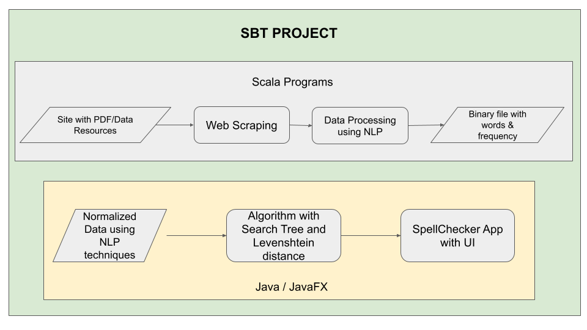

# Domain Specific SpellChecker

An application which delivers spell checker functionality for medical/health care domain. Spell checker support various downstream use cases when dealing with several text-based documents.

## HLD




## Requirements

- Intellij Idea 2020 Environment
- Scala Version 2.12.5
- sbt Version 1.4.7
- OpenJDK 11

## Dependencies

- build.sbt file as follows

```sh
name := "DS_SpellChecker"

version := "0.1"

scalaVersion := "2.12.5"

libraryDependencies ++= Seq(
  "org.scala-lang.modules" %% "scala-collection-compat" % "2.4.3",
  "org.jsoup" % "jsoup" % "1.8.3",
  "org.apache.spark" %% "spark-core" % "2.4.5",
  "org.apache.spark" %% "spark-sql" % "2.4.5",
  "org.apache.pdfbox" % "pdfbox" % "1.8.2",
  "com.uttesh" % "exude" % "0.0.4",
  "org.openjfx" % "javafx" % "11",
  "org.openjfx" % "javafx-base" % "11.0.2",
  "org.openjfx" % "javafx-graphics" % "11.0.2",
  "org.openjfx" % "javafx-fxml" % "11.0.2",
  "org.openjfx" % "javafx-media" % "11.0.2",
  "org.openjfx" % "javafx-swing" % "11.0.2",
  "org.openjfx" % "javafx-web" % "11.0.2",
  "org.openjfx" % "javafx-controls" % "11.0.2",
  "org.scalatest" %% "scalatest-funsuite" % "3.2.6" % Test,
  "org.scalatest" %% "scalatest" % "3.0.8" % Test
)
```

- Add the Javafx library JDK if runtime components are missing by following the steps in the following [link](https://stackoverflow.com/questions/52682195/how-to-get-javafx-and-java-11-working-in-intellij-idea)


## Overall Structure of the Project

1. WebScraping using jSoup

```sh
src/main/scala/WebScraping/WebScrape.scala
```

PDFs are downloaded from each pages using scraping technique from jSoup and are saved in the files folder. I've Scraped 100 pages with total of 979 files.

Total no of Pages - 11920

Change the total no of Pages to Scrape in the following Line.

```scala
 for (pageNo <- 1 to 100) { // change the no of page to scrawl here
      val pages = "https://www.biorxiv.org/content/early/recent?page=" + pageNo
```

2. Extracting the Data and removing the Stopping words and Filtering them.

```sh
src/main/scala/ExtractData/ExtractPdfData.scala
```

All the PDFs obtained from the scraping are stored in the files Directory, Each PDFs are converted into text format and binarized with the total number of words and it's frequencies. 

- PDFBOX module is used for reading the PDF data
- Filtered Data is finally stored in the file `dict.txt`

Sample of `dict.txt` is as Follows:

```txt
undermining 7
padler 1
mfdpir 4
abrupt 47
descriptor 37
```

3. Create a Package AlgoObjects to hold the Node for Ternary Search Tree used for Spell Checking and Priority Queue for listing out the Suggestions, We are using Levenshtein Distance algorithm for Comparing the words with Edit Distance.

```sh
src/main/scala/AlgoObjects/Node.java
```

- for Creating Node objects in Ternary Search Tree

```sh
src/main/scala/AlgoObjects/PriorityQueueElement.java
```

- for Prioritizing the Suggested words by comparing them with the Edit Distance

```sh
src/main/scala/AlgoObjects/TernarySearchTree.java
```

- for base class for ternary search tree by inserting the nodes at specific positions and search method to find a specific node

4. Create classes for Constructing Tree and Spell Checking

```sh
src/main/scala/Word.java
```

- Word class with SimpleStringProperty for basic string operations

```sh
src/main/scala/ConstructWordTree.java
```

- Reading the `dict.txt` file and seperating the tokens into word and it's frequencies

- Constructing the Ternary Search Tree with the tokens created.

```sh
src/main/scala/SpellChecker.java
```

- for Creating the Ternary Search Tree, Calculating the Levenshtein distance and traversing throught the tree and getting the List of Suggested words.

5. Creating UI for Spell Checking using JavaFX

```sh
src/main/scala/SpellCheckerApp.java
```

- Main Application for accepting the input text and performing the checking using the Correct method.

```sh
src/main/scala/SpellCheckAppController.java
```

- Controller class for creating the UI elements for the JavaFx app with a text field, button and a table area for printing Suggestions

```sh
src/main/scala/SpellCheckApp.fxml
```

- FXML file for Application is defined in this file.

## Sample Output video

Output Video for Domain specific Spell Checker can be seen in the following

[Demo Video](https://www.dropbox.com/s/j848ueulode7emd/output-video.mp4)


## Report

- Used only 979 PDF files due to computational Limitation, more can be done with the following code.

- 1070ms to create Word tree for 184384 words

- Spell Checker with Edit Distance - 8 is done.

- Filtering the words (Data) can be improved.

- Basic Test cases are covered for the Java Classes, test Cases for all Possibility need to be written.